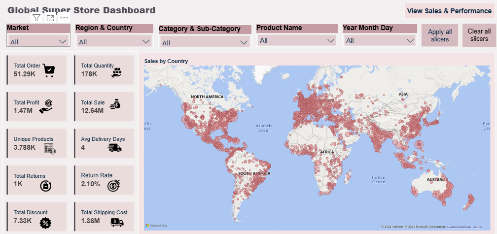

📊 Global Super Store Power BI Dashboard

📝 Project Overview
The **Global Super Store Dashboard** is an end-to-end Power BI reporting project that provides insights into **sales, profit, returns, shipping performance, and customer/product analytics** across different regions and markets.  

This project demonstrates **Power Query transformation,data modeling, DAX calculations and interactive visualization**.
---
📂 Data Source  
This project uses the **Global Superstore dataset**, available publicly on **Kaggle**:  

🔗 [Global Superstore 2016 Dataset on Kaggle](https://www.kaggle.com/datasets/tahir1413/global-superstore-2016)  

The dataset contains information on:  
- Orders (Order ID, Order Date, Ship Date, Customer, Region, Market)  
- Products (Category, Sub-Category, Product Name)  
- Sales metrics (Sales, Profit, Quantity, Discount, Shipping Cost)  
- Shipping performance (Ship Mode, Delivery Days)
- Returns  

---

📌 Requirements

🔑 KPIs Required
1. **Total Orders** – Number of individual orders placed within a specified time frame.  
2. **Total Quantity** – Total items sold across all orders.  
3. **Total Sales** – Total revenue generated before discounts or returns.  
4. **Total Profit** – Profit made after deducting costs.  
5. **Unique Products** – Number of distinct products sold.  
6. **Average Delivery Days** – Avg. time taken to deliver products.  
7. **Total Returns** – Number of products returned by customers.  
8. **Return Rate** – % of orders returned = Total Returns ÷ Total Orders.  
9. **Total Discount** – Value of discounts applied.  
10. **Total Shipping Cost** – Cost incurred in shipping products.  

---

📊 Visuals Required
1. **Map Visual** – Sales distribution across geographies (Country, State, City).  
2. **Line Chart (Sales & Profit by Year/Month)** – Time trend of sales and profit.  
3. **Pie Chart (Sales by Segment & Market)** – Sales share by Customer Segment & Market (e.g., Consumer, Corporate, Home Office, APAC, EMEA).  
4. **Matrix Visual (Orders & Shipments by Year/Month)** – Compare order and shipment trends in tabular format.  
5. **Clustered Column & Line Chart (Top 5 Customers)** – Top 5 customers by profit with sales overlay.  
6. **Clustered Bar Chart (Top 5 Profit & Top 5 Loss Products)** – Compare best and worst performing products.  
7. **Pie Chart (Sales by Ship Mode)** – Contribution of shipping methods (Standard, Express, etc.).  

---

🔐 Row-Level Security (RLS)
- **RLS implemented at Market Level** – ensures users only view data for their assigned market.  
- Protects sensitive sales and order data, enabling secure role-based reporting.  
---

🧮 DAX Calculations

📅 Calendar Table  
```DAX
Calendar =
ADDCOLUMNS(
    CALENDAR(MIN(Orders[Order Date]), MAX(Orders[Order Date])),
    "Year", YEAR([Date]),
    "Month", MONTH([Date]),
    "YearMonth", FORMAT([Date], "YYYY-MMM"),
    "MonthSort", FORMAT([Date], "MMM"),
    "Day", DAY([Date])
)

📊 Calculated Columns & Measures
**Delivery Performance**
Shipping Days = DATEDIFF(Orders[Order Date], Orders[Ship Date], DAY)
Avg Delivery Days = AVERAGE(Orders[Shipping Days])

**Returns & Return Rate**
Total Returns = COUNT(Returns[Order ID])
Return Rate = DIVIDE([Total Returns], COUNT(Orders[Order ID]), 0)

**Sales & Profit**
Total Sale = SUM(Orders[Sales])
Total Profit = SUM(Orders[Profit])

**Shipment Analysis**
Total Shipped =
CALCULATE(
    COUNT(Orders[Ship Date]),
    USERELATIONSHIP(Orders[Ship Date], 'Calendar'[Date])
)

Total Order = COUNT(Orders[Order Date])
Shipped Variance % =
DIVIDE([Total Order] - [Total Shipped], [Total Order], 0)

**Quantity, Discount & Shipping Cost**
Total Quantity = SUM(Orders[Quantity])
Total Discount = SUM(Orders[Discount])
Total Shipping Cost = SUM(Orders[Shipping Cost])


📊 Key Insights

Consumer segment contributes the highest revenue (6.5M).
Europe & USCA are top-performing markets.
Canon Printers & Cisco Smartphones drive the most profit.
Certain furniture & tech products incur losses.
Return rate is low (2.1%), reflecting strong product quality.
Shipments closely match orders (<1% variance)

🛠️ Tools & Technologies

Power BI Desktop – Data modeling & visualization
Power Query – Data cleaning & transformation
DAX – KPI calculations & business logic
RLS – Secure, role-based reporting.

📷 Dashboard Preview




